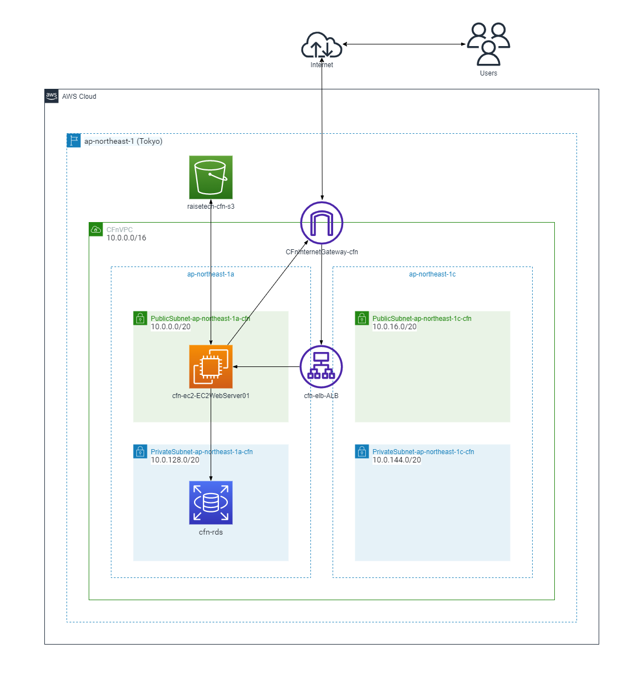
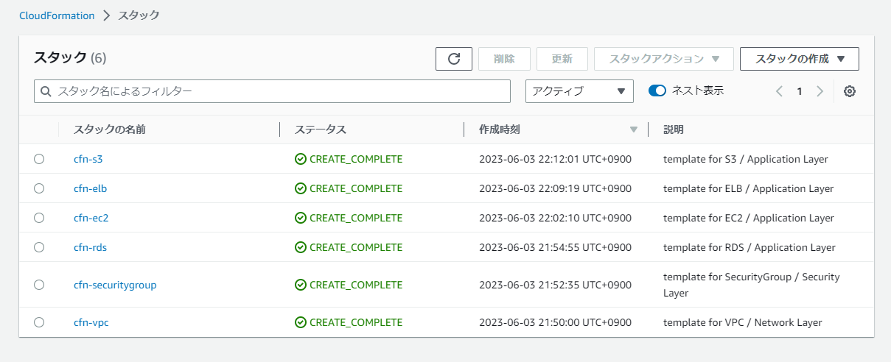

# 【 インフラ構築 実践 】<br>

## ■ 概要
- インフラ構築・設定など、下記の実践内容を記載
  - AWS上に Ruby on Rails のサンプルアプリケーションをデプロイ
  - CloudFormation を使用したインフラリソースの構築
  - オンラインスクールでのアウトプット一覧　( 実践/学習記録 )

<br>

## ■ AWS上に Ruby on Rails のサンプルアプリケーションをデプロイ<br>
【 実践内容 】
- EC2上にサンプルアプリケーションをデプロイ
  - 組み込みサーバ ( Puma ) でデプロイ
  - Webサーバ ( Nginx ) / APサーバ ( Unicorn ) に分けてデプロイ
- ELB (ALB) / S3  を追加・動作確認
- Rails の Active Storage を連携、画像の保存先をS3に設定
- AWS構成図作成 ( VPC / EC2 / RDS / ELB / S3 )

| 動作環境 | バージョン |
| -------- | ---------- |
| Ruby     | 3.1.2      |
| Bundler  | 2.3.14     |
| Rails    | 7.0.4      |
| Node     | v17.9.1    |
| Yarn     | 1.22.19    | <br>

<br>

- デプロイ - [全手順](./Tasks/lecture05/lecture05.md)
- デプロイ - [部分手順](./Tasks/lecture05//building_procedure) ( ※上記各手順別の構築・設定手順 )
- AWS構成図
<br>
- Webアプリケーション ( デプロイ・ブラウザ動作確認 )
/browser_check1.png)<br>

<br>

## ■ CloudFormation を使用したインフラリソースの構築<br>
【 実践内容 】
- [構築実践の取組](./Tasks/lecture10/lecture10.md)　( ※下記構成図のリソース構築を実施 )
- 各リソース/スタックのテンプレートファイル ( [CloudFormation_templates](./Tasks/lecture10/CloudFormation_templates) ) を作成
- その他、ベストプラクティス・セキュリティ対策を考慮して下記取組を実施
  - BlackBeltを参照してベストプラクティスなどをインプット、実践はその内容を踏まえて実施
  - ハードコーディングを避けるための動的参照 - SSMパラメータストア を活用
  - RDS - SecretsManager での認証情報 (シークレット) 管理を反映
  - EC2 - SessionManager を活用　( ※SSH接続に関する設定は、後学のために削除せず記述を残置 )<br>
- AWS構成図

- テンプレートファイル構成
```
|-- CloudFormation_templates
|   |-- 01_cfn-vpc.yml
|   |-- 02_cfn-securitygroup.yml
|   |-- 03_cfn-rds.yml
|   |-- 04_cfn-ec2.yml
|   |-- 05_cfn-elb.yml
|   `-- 06_cfn-s3.yml
```
- 各リソースのスタック<br>
( ※各リソースのスタック名は テンプレートファイル名から引用/命名し、構築を実施 )<br>
<br>

<br>

## ■ オンラインスクールでのアウトプット一覧　( 実践/学習記録 )<br>
- オンラインスクール (RaiseTech) での実践/学習記録を各ファイルに記載

| Files                                                  | Contents                                                                                |
| :---------------------------------------------------: | :------------------------------------------------------------------------------------: |
| [lecture02.md](./Tasks/lecture02.md)           | Git/GitHubを用いたチーム開発におけるバージョン管理                                     |
| [lecture03.md](./Tasks/lecture03.md)           | Ruby on RailsによるWebアプリケーションのデプロイ                                       |
| [lecture04.md](./Tasks/lecture04.md)           | VPC･EC2･RDSの構築                                                                    |
| [lecture05.md](./Tasks/lecture05/lecture05.md) | Ruby on Rails サンプルアプリケーションのデプロイ<br>・ELB(ALB) / S3 の構築・構成図作成 |
| [lecture06.md](./Tasks/lecture06/lecture06.md) | 証跡・ロギング / 監視・通知 / コスト管理                                               |
| [lecture07.md](./Tasks/lecture07/lecture07.md) | セキュリティ対策                                                                       |
| [lecture10.md](./Tasks/lecture10/lecture10.md) | インフラ自動化 / IaC / CloudFormation                                                  | <br> |
