#  【 lecture06 ： 証跡・ロギング / 監視・通知 / コスト管理 】

 

## ■ 実践内容 (目次)
1. [証跡・ロギング](#1-証跡ロギング) 
    1-1. [イベント情報を確認　(  【 CloudTrail 】 イベント名 / 含まれている内容を3つピックアップ )](#1-1--イベント情報を確認---cloudtrail--イベント名--含まれている内容を3つピックアップ-)
2. [監視・通知](#2-監視通知) 
  2-1. [アラームの作成・メール通知　( 【 CloudWatch 】 ELB (ALB)：アラーム状態 / OKアクション )](#2-1-アラームの作成メール通知--cloudwatch--elb-albアラーム状態--okアクション-)
3. [コスト管理](#3-コスト管理) 
  3-1. [AWS利用料の見積作成・URL共有　( 【 AWS pricing calculator 】 )](#3-1-aws利用料の見積作成url共有--aws-pricing-calculator--) 
  3-2. [現在の利用料確認　(  【 Billing 】 EC2料金 / 無料利用枠内か？ )　](#3-2-現在の利用料確認---billing--ec2料金--無料利用枠内か-)

 

---

 

## 1. 証跡・ロギング

【 講義・リサーチ ( メモ ) 】

 

■ CloudTrail　( AWSイベントの記録・証跡保存 ) 
- デフォルトで有効化されており、イベント履歴は90日間保存可能 
( ※90日以上保存させる場合は、証跡を作成し S3 へ保存 )
- アプリケーションの証跡は確保しないため、その際はアプリケーションのログを確認
- 簡易な検索機能しかないため、必要に応じて 別途 Amazon Athena で SQL検索するなど組み合わせが必要
- 【 参考リンク 】 [AWS CloudTrailを触ってみた](https://www.youtube.com/watch?v=erDYixgVJ0o) 

 

■ Config　(各種リソースの変更履歴を保管するサービス) 

 

---

■ セキュリティ侵害時の証跡サービスの使い方 
- CloudTrail で大まかな侵入時間を把握、Config でリソースに対してどのような変更がされたかを確認 

---

 

■ VPCフローログ　( VPC内のログを取るサービス ) 
- VPC作成後、有効化が必要 
- ENIの通信ログを取得 
- 保存先 及び 使い分け 
( ① CloudWatch Logs ( 短期保存：例. 7日程度 ) / ② S3 ( 長期保存 ) ) 
( 補足：別途、ポリシー作成・アタッチ等作業が必要 ) 

■ CloudWatch Logs　( OS管理せずログ閲覧を可能とするサービス ) 

■ 障害調査フロー 
1. 事象確認
2. 各種ログ確認
3. 原因特定
4. 障害調査 及び 対処 

 

■ ログ取得 / 保存することの意義　( = ※自分・チーム・顧客・システムを守ること ) 

 

---

 

### 1-1.  イベント情報を確認　(  【 CloudTrail 】 イベント名 / 含まれている内容を3つピックアップ )

 

■ イベント履歴　( 最後にAWSを利用した日の記録 ) 
- 《 イベント名 》 PutMetricAlarm　( = ※後述の CloudWatchアラーム ( OKアクション ) 作成分 )
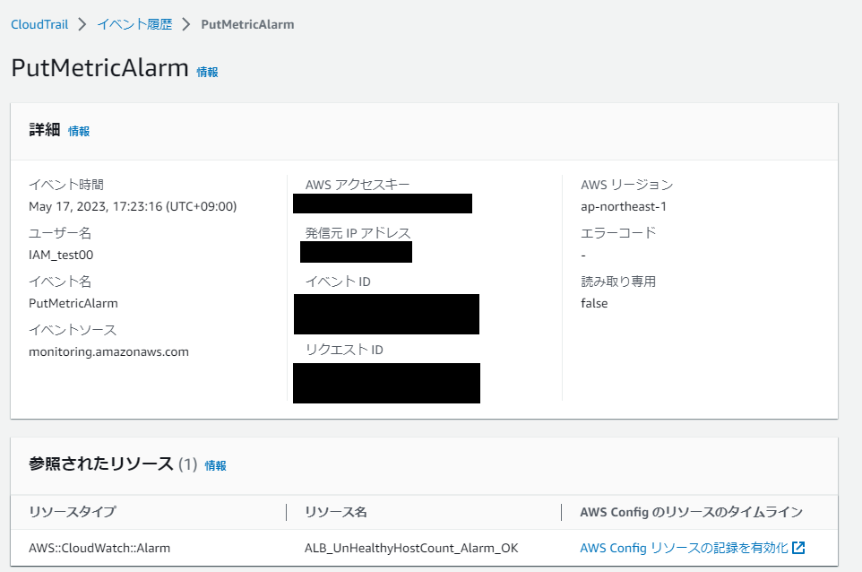 
( イベントレコードより抜粋 ) 
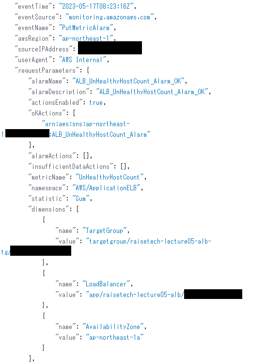 

■ 上記イベント内容に含まれている情報
- イベント時間
- ユーザー名
- イベントソース etc.  

---

 

## 2. 監視・通知

【 講義・リサーチ ( メモ ) 】

 

■ CloudWatch　( 監視関連機能を提供 ) 

《 主な機能 3種 》 
1. メトリクス ( 各種リソースの情報採取 ) 
( ※EC2・RDSのモニタリング タブより標準メトリクスが確認可能 ) 
1. アラーム ( メトリクス情報を元に閾値を設定し、条件に該当すればアラーム発報・通知 ) 
1.  メトリクスフィルター ( CloudWatch Logs メトリクスフィルター：フィルタリング機能を提供 ) 
( ※閾値だけでなく、ログ内容に応じてアラーム発報・通知も可能 ( 例. rootログイン時に通知 等 ) ) 
( ※設定次第では、アプリケーションのログとも連携が可能 ) 

 

■ EventBridge　( 旧 CloudWatch Event )
- イベントをトリガー ( 条件 )として、他のサービスとの連携やアクションを実行することが可能 

 

---

 

### 2-1. アラームの作成・メール通知　( 【 CloudWatch 】 ELB (ALB)：アラーム状態 / OKアクション )

 

( ※今回は、ELB (ALB) の `Unhealthy` を検知してアラーム発報 ( メール通知 ) する設定を2つ作成 ：アラーム状態 / OKアクション )

 

■ アラーム作成 ( アラーム状態分 ) 
- 《 アラーム名 》 `ALB_UnHealthyHostCount_Alarm` 　( ※アラーム作成の手順は [CloudWatch_alarm_setting.md](./CloudWatch_alarm_setting.md) を参照 ) 

- EC2の Nginx 停止後、ターゲットグループ画面にて `Health status` を確認 
( 正常稼働時 )
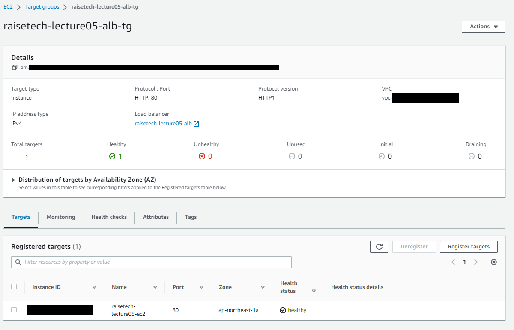
( Nginx 停止後　( ※ `unhealthy` 状態となっていることを確認 ) ) 
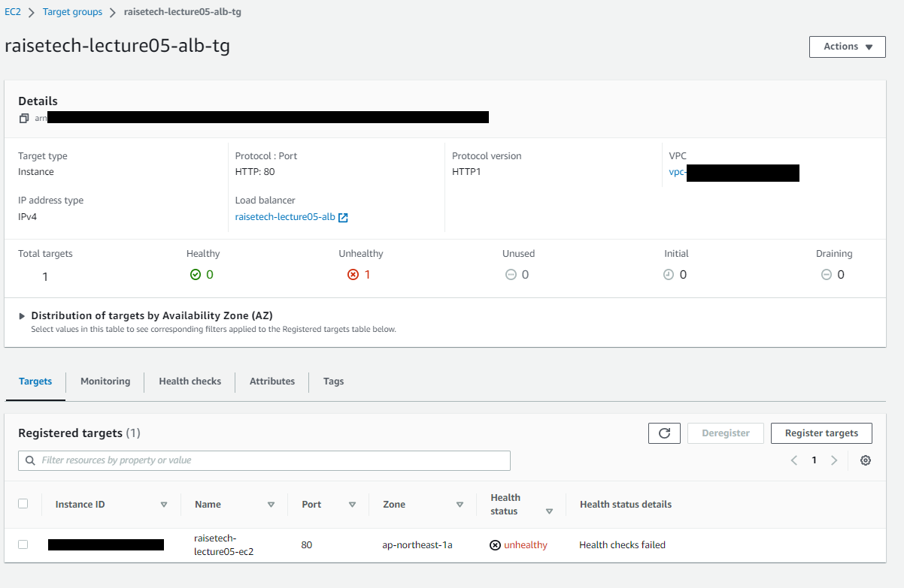

- アラーム履歴より、アクション ( アラーム発報 ( メール通知 ) ) が実行されたことを確認
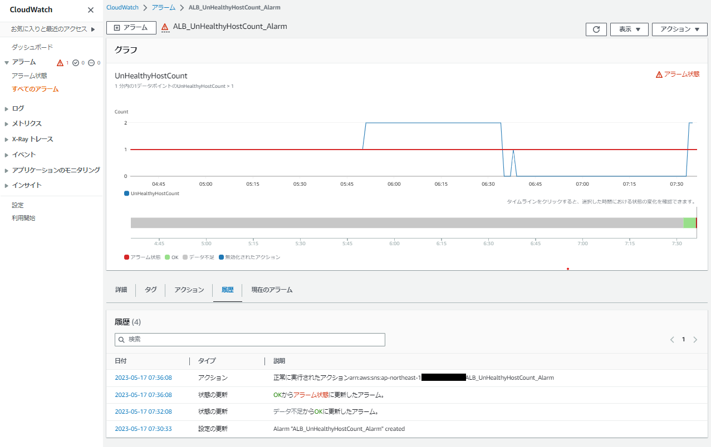

- メール通知/受信 ( アラーム状態分のアラーム ) を確認
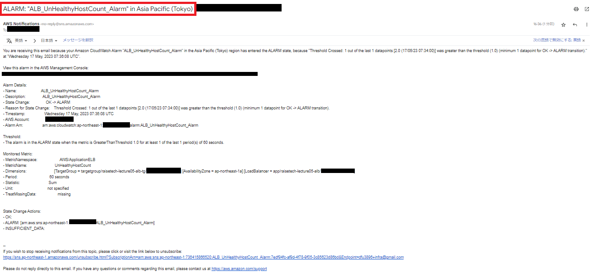

■ アラーム作成 ( OKアクション分 ) 
- 《 アラーム名 》 `ALB_UnHealthyHostCount_Alarm_OK`　( ※アラーム作成の手順は [CloudWatch_alarm_setting.md](./CloudWatch_alarm_setting.md) を参照 ) 

- EC2の Nginx を再起動後、ターゲットグループ画面にて `Health status` を確認 
( ※ `healthy` 状態となっていることを確認 )
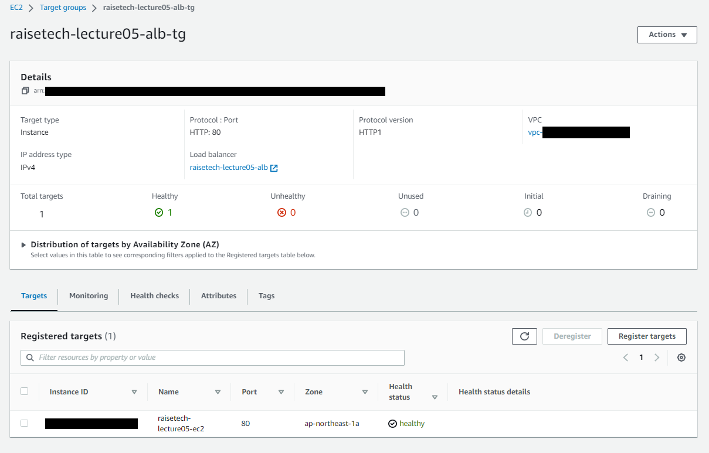
- アラーム履歴より、アクション ( アラーム発報 ( メール通知 ) ) が実行されたことを確認
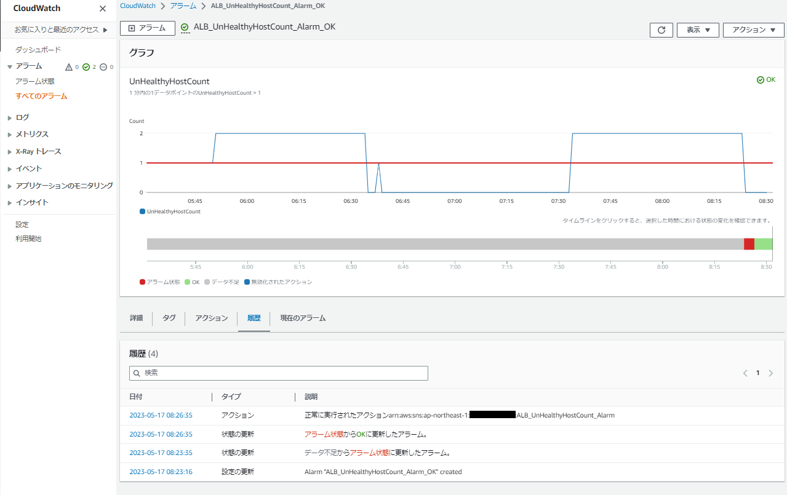

- メール通知/受信 ( OKアクション分のアラーム ) を確認
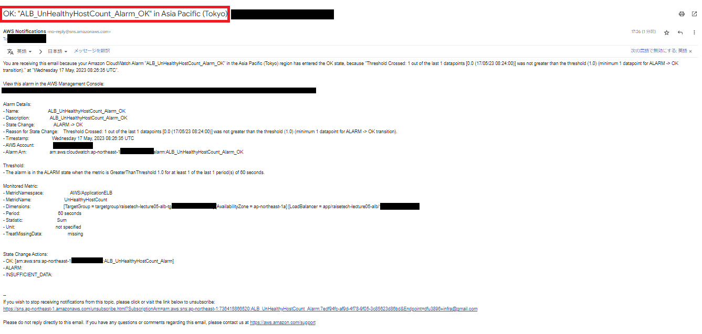

■ 今回作成したアラーム
-  ( OKアクション分 ) `ALB_UnHealthyHostCount_Alarm_OK`
-  ( アラーム状態分 ) `ALB_UnHealthyHostCount_Alarm`
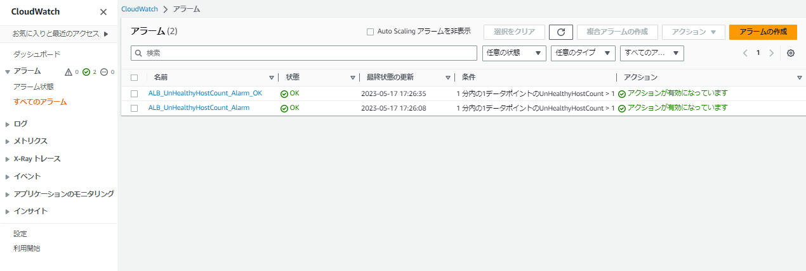
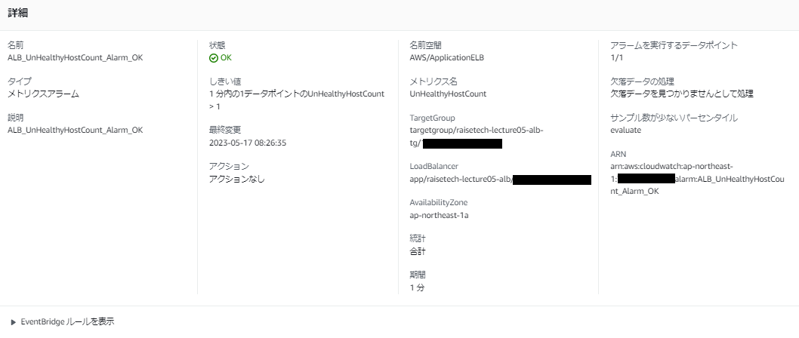
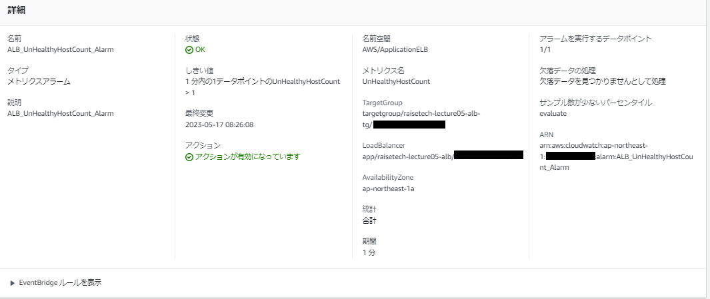

 

---

 

## 3. コスト管理

【 講義・リサーチ ( メモ ) 】

 

■ 試算(見積作成) 
- AWS pricing calculator　( ※作成した見積もりの共有が可能 )

■ コスト管理
- Billing　( ※請求管理が可能 )
- コスト配分タグ　( ※要 有効化 / `Tag Editor` でタグの一括付与等 管理が可能 )

■ コスト可視化
- Cost Explorer　( ※コストをグラフ化し、フィルター / 分析が可能 )
- コスト配分タグを使用し、タグ毎にグループ化されたコスト管理が可能

■ 予算管理
- Budgets　( ※予算超過前後に通知 / 設定テンプレートあり )
- Cost Anomaly Detection　( ※AIによるコスト変動検知サービス ) 

 

---

 

### 3-1. AWS利用料の見積作成・URL共有　( 【 AWS pricing calculator 】 )

 

■ 見積作成後、URL共有を実施　( 下記リンク参照 ) 
- [AWS pricing calculator - My Estimate](https://calculator.aws/#/estimate?id=5084737e8469b3e953382d25dca6b9f64e15fdce)

 

### 3-2. 現在の利用料確認　(  【 Billing 】 EC2料金 / 無料利用枠内か？ )　

 

■ EC2料金
- 現在の利用料：USD 1.49 (税別)　( 2023.5月分 )
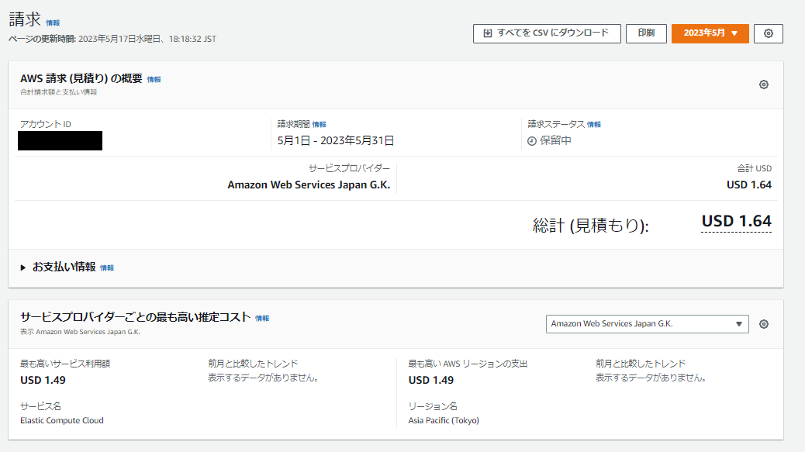
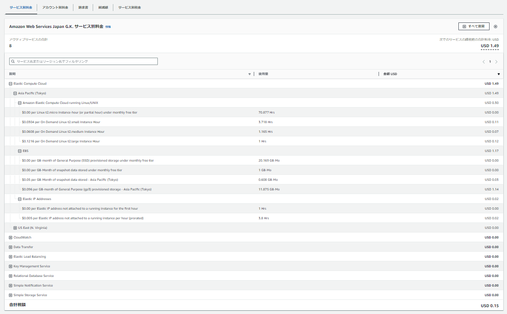
- 先月の利用料：USD 0.09 (税別)　( 2023.4月分 )
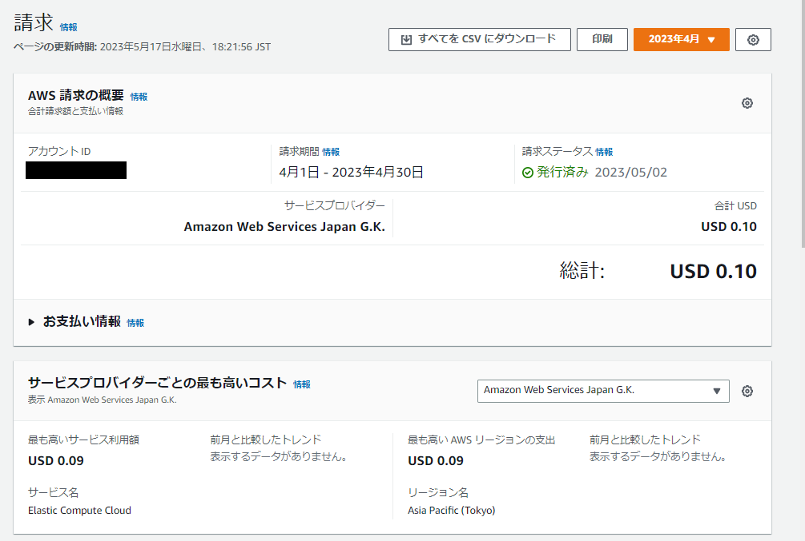
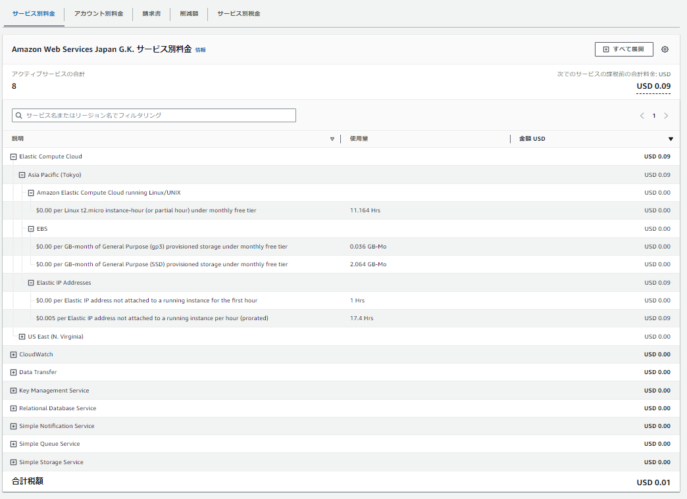

■ 無料利用枠内か？ 
-  EC2関連の利用料が、無料利用枠を超過している
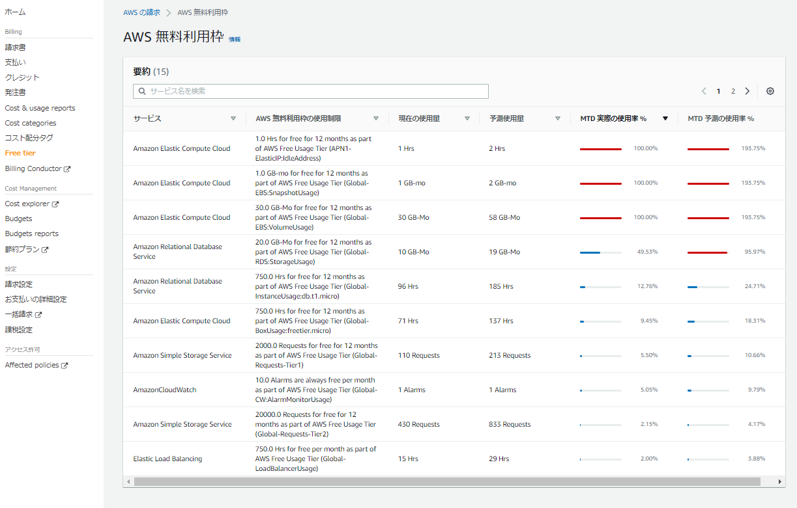

 

■ 無料利用枠超過分について確認
- ElasticIP:IdleAddress - ※アタッチ後、EC2インスタンスを停止していたため費用が発生
- EBS:Snapshot - ※第5回課題提出終了時、 AMI ( EC2 ) を作成したため費用が発生したと思われる
- EBS:Volume - ※第5回課題取組時、複数の EC2インスタンス を立ち上げていたため費用が発生したと思われる 

 

---

 

■ ( 補足 ) Budgetsによる予算設定も実施　( ※テンプレートを使用 )
  - 月額予算 ( $5.00 )： `My Monthly Cost Budget`
  - 無料利用枠超過時： `My Zero-Spend Budget`
  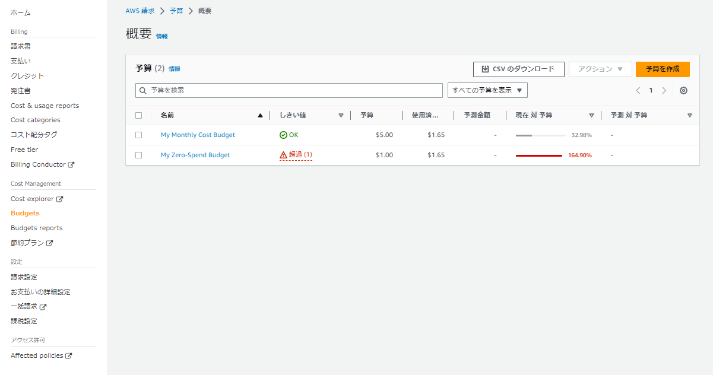
