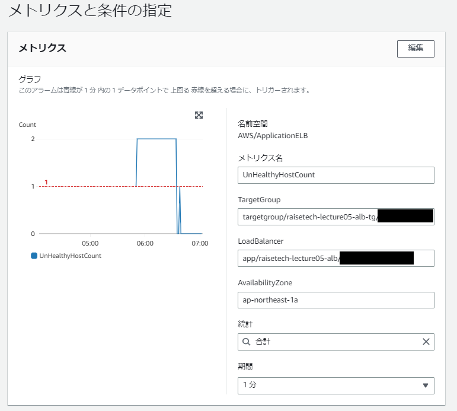
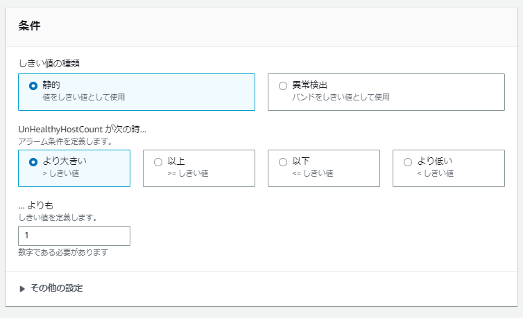
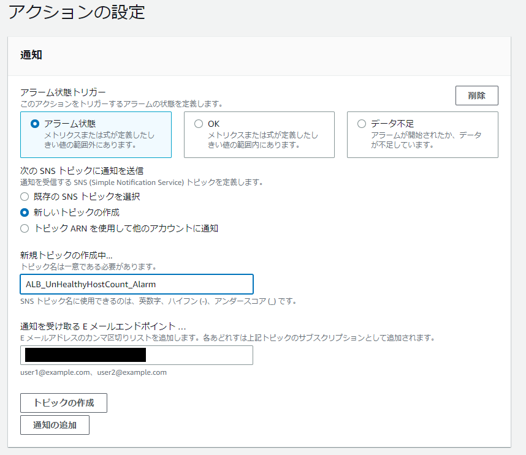
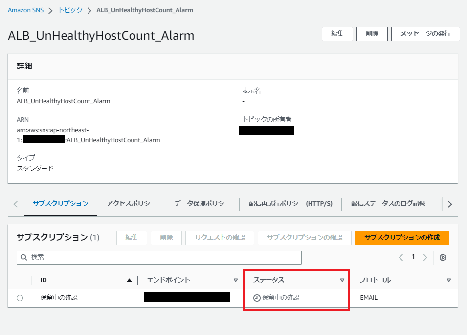
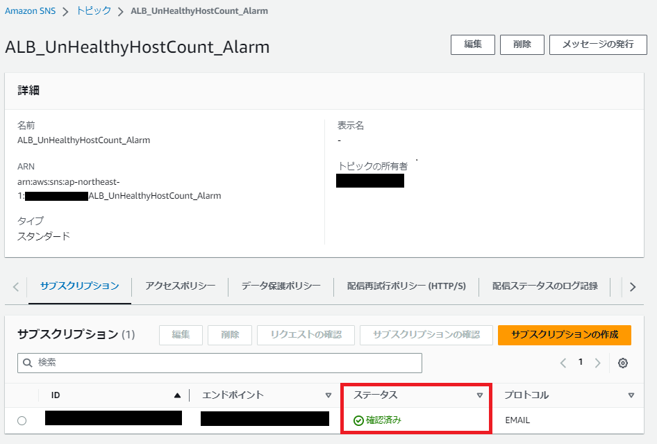
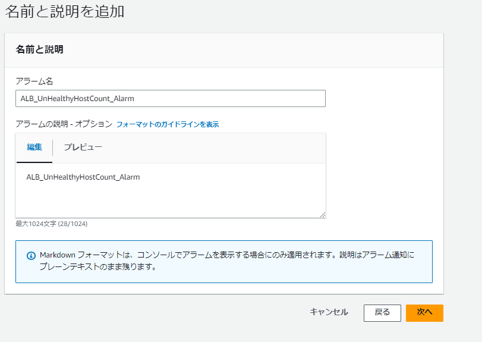
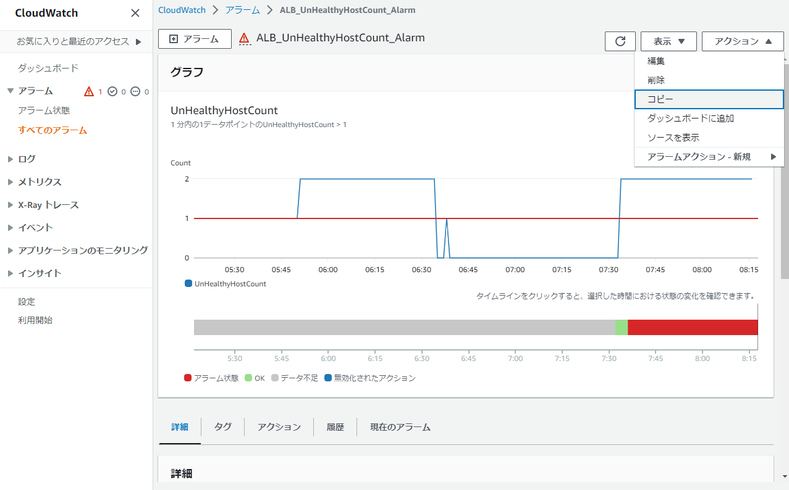
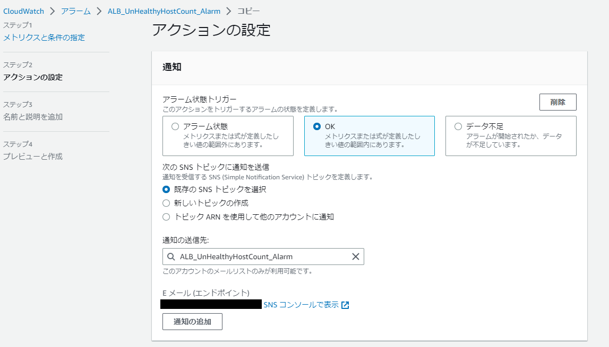

# 【 CloudWatch：アラーム作成 / 設定 手順】

1. [アラーム作成 ( アラーム状態分 )](#1-アラーム作成--アラーム状態分-)
2. [アラーム作成 ( OKアクション分 )](#2-アラーム作成--okアクション分-)

 

( ※今回は、ELB (ALB) の `Unhealthy` を検知してアラーム発報 ( メール通知 ) する設定を2つ作成 ：アラーム状態 / OKアクション )

 

---

 

## 1. アラーム作成 ( アラーム状態分 )

 

《 アラーム名 》 `ALB_UnHealthyHostCount_Alarm`

 

- Cloudwatch - [ アラーム ] - [ アラームの作成 ] を押下

- メトリクスの選択 
( [ ApplicationELB ] - [ AppELB 別、AZ 別、TG 別メトリクス ] - メトリクス名 [ UnHealthyHostCount ] を選択 )

- メトリクスと条件の指定　( 下図の通りに設定 ) - [ 次へ ]を押下

- アクションの設定　( 下図の通りに設定 )

- [ 新しいトピックの作成 ] 後、 [ SNSコンソールで表示 ] を押下 
( ※遷移先画面で [ サブスクリプション ] タブ - [ ステータス ( 保留中の確認 ) ] を確認 )　(下図参照) 

- 通知先として設定したメールアドレスに同意承認のメールが来るため、承認を実施

- SNSコンソール画面 ( [ サブスクリプション ] タブ - [ ステータス ( 確認済み ) ] を確認)　(下図参照) 

- アクションの設定 - [ 次へ ] を押下

- 名前と説明を追加　( 任意のアラーム名・アラームの説明を明記 ) - [ 次へ ]を押下

- プレビューと作成 - [ アラームの作成 ] を押下

 

---

 

## 2. アラーム作成 ( OKアクション分 )

 

《 アラーム名 》 `ALB_UnHealthyHostCount_Alarm_OK` 

 

( ※前の手順で作成した上記アラーム  `ALB_UnHealthyHostCount_Alarm` をコピーして作成 ) 

 

- Cloudwatch - [ アラーム ] - [ `ALB_UnHealthyHostCount_Alarm` を押下して詳細画面を表示 ]

- [ アクション ] - [ コピー ]を押下

- メトリクスと条件の指定 ( ※上記  `ALB_UnHealthyHostCount_Alarm` と同じ設定条件とする ) - [ 次へ ] を押下

- アクションの設定　( 下図の通りに設定 ) - [ 次へ ] を押下

- 名前と説明を追加　( 任意のアラーム名・アラームの説明を明記 ) - [ 次へ ] を押下

- プレビューと作成 - [ アラームの作成 ] を押下
