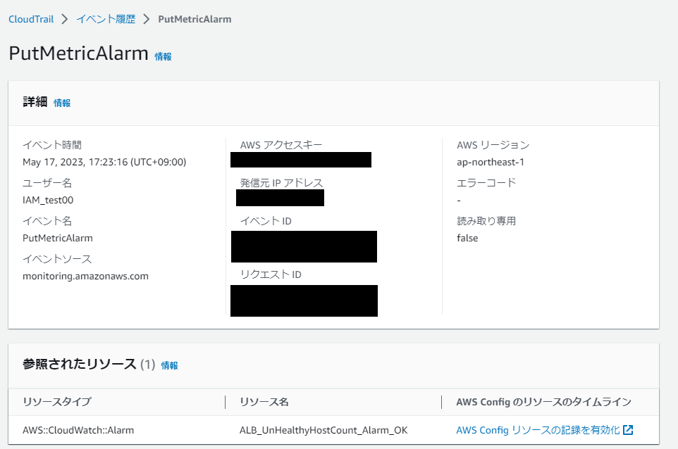
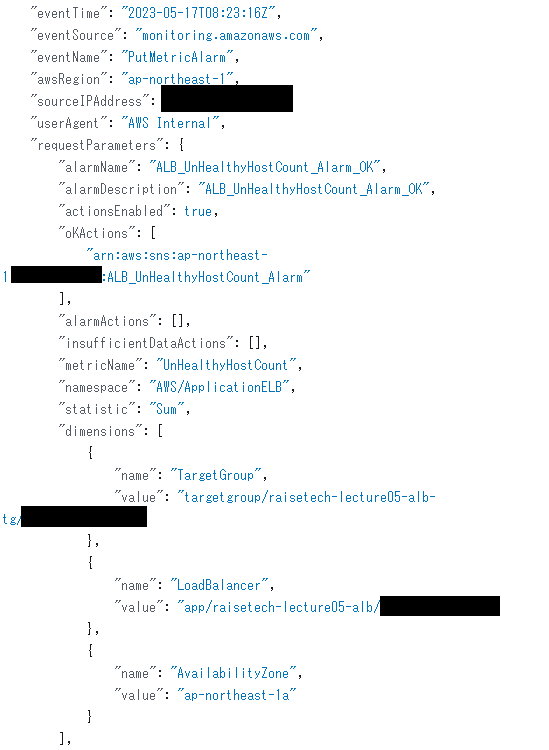

#  【 lecture06 ： 証跡・ロギング / 監視・通知 / コスト管理 】

 

## ■ 課題内容 (目次)
1. 証跡・ロギング 
    1-1. 【 CloudTrail 】 イベント情報を確認 ( イベント名・含まれている内容を3つピックアップ )
2. 監視・通知 
    2-1. 【 CloudWatch 】アラーム作成・メール通知 ( ELB (ALB) ： アラーム状態・OKアクション )
3. コスト管理 
    3-1. 【 AWS pricing calculator 】 AWS利用料の見積作成・URL共有 
    3-2. 【 Billing 】 現在の利用料確認 ( 先月のEC2料金・無料利用枠内か？ )

 

---

 

## 1. 証跡・ロギング

【 講義・リサーチ ( メモ ) 】

 

■ CloudTrail　( AWSイベントの記録・証跡保存 ) 
- デフォルトで有効化されており、イベント履歴は90日間保存可能 
( ※90日以上保存させる場合は、証跡を作成し S3 へ保存 )
- アプリケーションの証跡は確保しないため、その際はアプリケーションのログを確認
- 簡易な検索機能しかないため、必要に応じて 別途 Amazon Athena で SQL検索するなど組み合わせが必要
- 【 参考リンク 】 [AWS CloudTrailを触ってみた](https://www.youtube.com/watch?v=erDYixgVJ0o) 

 

■ Config　(各種リソースの変更履歴を保管するサービス) 

 

---

■ セキュリティ侵害時の証跡サービスの使い方 
- CloudTrail で大まかな侵入時間を把握、Config でリソースに対してどのような変更がされたかを確認 

---

 

■ VPCフローログ　( VPC内のログを取るサービス ) 
- VPC作成後、有効化が必要 
- ENIの通信ログを取得 
- 保存先 及び 使い分け 
( ① CloudWatch Logs ( 短期保存：例. 7日程度 ) / ② S3 ( 長期保存 ) ) 
( 補足：別途、ポリシー作成・アタッチ等作業が必要 ) 

■ CloudWatch Logs　( OS管理せずログ閲覧を可能とするサービス ) 

■ 障害調査フロー 
1. 事象確認
2. 各種ログ確認
3. 原因特定
4. 障害調査 及び 対処 

 

■ ログ取得 / 保存することの意義　( = ※自分・チーム・顧客・システムを守ること ) 

 

---

 

### 1-1. 【 CloudTrail 】 イベント情報を確認 ( イベント名・含まれている内容を3つピックアップ )

■ イベント履歴　( 最後にAWSを利用した日の記録 ) 
- 《 イベント名 》 PutMetricAlarm　( = ※後述の CloudWatchアラーム ( OKアクション ) 作成分 )
 
( イベントレコードより抜粋 ) 
 

■ 上記イベント内容に含まれている情報
- イベント時間
- ユーザー名
- イベントソース etc.  

---

 

## 2. 監視・通知

【 講義・リサーチ ( メモ ) 】

 

■ CloudWatch　( 監視関連機能を提供 ) 

《 主な機能 3種 》 
1. メトリクス ( 各種リソースの情報採取 ) 
( ※EC2・RDSのモニタリング タブより標準メトリクスが確認可能 ) 
1. アラーム ( メトリクス情報を元に閾値を設定し、条件に該当すればアラーム発報・通知 ) 
1.  メトリクスフィルター ( CloudWatch Logs メトリクスフィルター：フィルタリング機能を提供 ) 
( ※閾値だけでなく、ログ内容に応じてアラーム発報・通知も可能 ( 例. rootログイン時に通知 等 ) ) 
( ※設定次第では、アプリケーションのログとも連携が可能 ) 

 

---

 

### 2-1. 【 CloudWatch 】アラームの作成・メール通知 ( ELB (ALB) ： アラーム状態・OKアクション )

 

---

  
## 3. コスト管理

【 講義・リサーチ ( メモ ) 】

  
### 3-1. 【 AWS pricing calculator 】 AWS利用料の見積作成・URL共有
### 3-2. 【 Billing 】 現在の利用料確認 ( 先月のEC2料金・無料利用枠内か？ )
