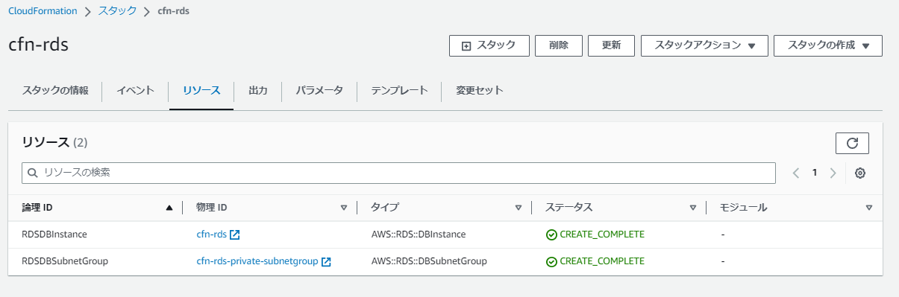

# 【 lecture10：インフラ自動化 / IaC / CloudFormation 】

1. [【 講義・リサーチ (メモ) 】](#1--講義リサーチ-メモ-)<br>
2. [【 スタック (テンプレート) の 構成 / 設計 】](#2--スタック-テンプレート-の-構成--設計-)<br>
3. [【 IaC / CloudFormation による リソース構築の実践 】](#3--iac--cloudformation-による-リソース構築の実践-)<br>
4. [【 今回の構築に関する 補足 / 取組 / 気づき / 工夫 / 備忘録 等 】](#4--今回の構築に関する-補足--取組--気づき--工夫--備忘録-等-)<br>
5. [【 参考リンク 】](#5--参考リンク-)<br>

<br>

( 補足：上記 1-2 はインプット (課題取組のための情報収集 等) 、3-5 はアウトプット (課題取組/実践 等) として内容を記載 )

<br>

---

<br>

## 1. 【 講義・リサーチ (メモ) 】

<br>

<details><summary>【 インフラ自動化 / IaC 】</summary>

<br>

■ インフラ自動化において考慮・検討・注意すべき事項<br>
- 自動化を構築する人材 / 構築されたものをメンテナンスする人材
- コスト削減のため盲目的に既存環境を自動化することはリスクも伴う
- 全自動・半自動 (=何かしらの工程で人の手が加わる自動化) / ( ※用途別に使い分け )<br>
- 全自動化可能なことを不安のため半自動化にすることはコストにしかならない<br>
- 自動化の考え方<br>
( ①全自動化 → ②必要に応じて一部を手動化 → ③②の一部を自動化 (半自動化) )<br>
( ※必要に応じてそもそも自動化すべき工程自体をなくすことも考慮する )

<br>

---

</details>

<details><summary>【 CloudFormation (各用語・概念等) 】</summary>

<br>

■ テンプレート<br>
- YAML / JSON形式で記述<br>
( ※CloudFormationのYAMLは、通常のYAML文法と異なる点がある )
- 1テンプレートにつき1スタックを作成
- 各リソースに記述する項目・設定方法は公式ドキュメントを参照<br>
( ※必須項目等を都度々々調べて記述 )<br>
《 参考：[AWS CloudFormation のドキュメント](https://docs.aws.amazon.com/ja_jp/cloudformation/index.html) 》<br>

<br>

■ スタック<br>
- テンプレートファイルによって自動構築されたリソース / 環境の1単位 (管理単位)<br>
( ※1テンプレートにつき、1スタックが作成される )
- スタック管理下にあるリソース構築前後の変更差分を検知/検出する<br>
：構築前 ( 変更セット ( Change Set ) ) / 構築後 ( ドリフト )<br>
- 修正したテンプレートを再読み込みすることでスタックの更新が可能<br>
- スタックを削除すると構築された環境が全て削除される<br>
- スタック作成時にエラーが起きるとロールバックが実行される<br>
( ※ただし、スタック自体は残るためエラー原因を確認して不必要になれば削除する )<br>
- スタック名の重複使用は不可

<br>

■ リソースID<br>
- リソース毎に存在する一意のID<br>
：主従 / 親子関係に関連し、これが何と何に紐づいているか把握することでテンプレートの各リソース記述に必要な要素が判別しやすくなる

<br>

■ 論理ID<br>
- リソースIDと区別するためのID<br>
：テンプレート内で使用する変数のようなもの (=テンプレート内で参照したい情報がある場合に指定)

<br>

■ クロススタック参照 (=スタック間の参照設定)<br>
- [ 参照元のテンプレート / スタック ]<br>
：Outputsセクションで他のテンプレートから参照できるように出力させる<br>
　( ※参照元では、出力名に擬似パラメータ参照 `AWS::StackName` を使用 )<br>
　( 記述例 `Name: !Sub ${AWS::StackName}-VPCID` )
- [ 参照先テンプレート / スタック ]<br>
：Parametersセクションに出力名の一部をデフォルト値として キー/値 で設定し、importValue関数で上記を読み込ませる<br>
　( 記述例 `Fn::ImportValue: !Sub ${VPCStack}-VPCID` )<br>
　( 補足：importValue関数は、`!Sub(短縮形)` が含まれる場合は `!importValue(短縮形)` が使用できないため `Fn::ImportValue` で記述する )

<br>

■ 組込関数<br>
- 各種関数の内容は公式ドキュメントを参照<br>
( ※上手く活用することで記述するコード数の削減が可能 )<br>
《 参考：[組み込み関数リファレンス](https://docs.aws.amazon.com/ja_jp/AWSCloudFormation/latest/UserGuide/intrinsic-function-reference.html) 》<br>
  - !Ref関数 ( 同一テンプレート内での参照に用いる )<br>
  - !GetAtt関数 ( 指定するリソースの所属情報を参照する場合に用いる )<br>
 ( 例. [SGが所属するSGID・VPCID](https://docs.aws.amazon.com/ja_jp/AWSCloudFormation/latest/UserGuide/aws-properties-ec2-security-group.html#aws-properties-ec2-security-group-return-values) 等 )<br>
  - !Sub関数<br>
( スタックを作成または更新するまで使用できない値を含むコマンドまたは出力を作成 )<br>
( 例. `!Sub ${}` ( =Parametersセクションに記述した キー/値 を ${} に代入 等 ) )

<br>

■ パラメータ設定 ( Parametersセクションで記述 )<br>
- 固定値ではなく、スタック毎に値を変更したい場合などに設定

<br>

■ ユーザデータ ( [AWS::EC2::Instance のプロパティ ](https://docs.aws.amazon.com/ja_jp/AWSCloudFormation/latest/UserGuide/aws-properties-ec2-instance.html#cfn-ec2-instance-userdata))<br>
- インスタンス起動(作成)時、1回だけ記述されたコマンドを実行<br>
( ※データ削除などを引き起こす場合があるため、基本的には使用しない方が無難 )<br>
\- 代替案① ( 手動でスクリプト実行したのち、そのスクリプトを削除 )<br>
\- 代替案② ( Ansbleで一度実行したものは二度と実行させないように設定 )

<br>

---

</details>

<details><summary>【 ツール 】</summary>

 <br>

- [CloudFormation デザイナー](https://docs.aws.amazon.com/ja_jp/AWSCloudFormation/latest/UserGuide/working-with-templates-cfn-designer.html)<br>
( グラフィックツール (※チェックとして活用等する) )<br>
- [Former2](https://www.former2.com/)<br>
( 既存リソースから Infrastructure as Code 出力を生成できるようにする Webサービス )<br>
</details>

<br>

---

<br>

## 2. 【 スタック (テンプレート) の 構成 / 設計 】

<br>


■ スタック (テンプレート) 分割 ( 設計観点・考え方 )<br>
- スタック(テンプレート)の運用・管理を考慮したうえで設計 ( 分割/構成 ) を実施<br>
( ※具体的には 下記の ①-③ の設計観点で構成、スタック間はクロススタック参照にて情報を参照・関連付ける )<br>

<br>

■ 設計観点①　【 3層構造 (レイヤー毎) に分割/構成 】<br>
　( ※考え方としては、依存度・ライフサイクル (更新周期) 毎にレイヤーを分け、それに合わせてスタック (テンプレート) の分割を行う )<br>
　( ※下記 1-3 の関係性/属性：1 は依存される側/更新頻度(低)、3 は依存する側/更新頻度(高) )
1. Network Layer ( VPC/サブネット/ルートテーブル 等 )
2. Security Layer ( セキュリティグループ/IAM 等 )
3. Applicaton Layer ( EC2/RDS/ELB 等 )<br>

<br>

■ 設計観点②　【 上記 `3. Aplicaton Layer` はさらに下記に細分化して分割/構成 】<br>
　( ※ 下記 3-1 - 3-3 の関係性/属性：3-1 は依存される側/更新頻度(低)、3-3 は依存する側/更新頻度(高) )<br><br>
　3-1. 共有サービス ( 認証･プロキシ･メール等サーバ：Directory Service/Route53 等 )<br>
　3-2. Data ( データ/状態を保持するリソース (ステートフル)：RDS/S3 等 )<br>
　3-3. Applicaton ( データ/状態を保持しないリソース (ステートレス)：EC2/ELB/ECS/AutoScalling 等 )<br>

<br>

■ 設計観点③　【 その他 考慮すべき事項 】<br>
　( ※メンテナンス等、実施者/チーム/所有者など スタック (テンプレート) の 運用/管理者 毎の分割設計も考慮が必要 )

<br>

■ スタック (テンプレート) 構成図 - (例)<br>
- 下記の構成図を参考に スタック (テンプレート) を分割/設計<br>
( ※ 下図のグレー箇所毎にスタック (テンプレート) を作成 )<br>
《 参考：[AWS Black Belt Online Seminar AWS CloudFormation - スライド88 ](https://www.slideshare.net/AmazonWebServicesJapan/20200826-aws-black-belt-online-seminar-aws-cloudformation-238501102)》<br>


<br>

■ 参考資料<br>
　[【AWS Black Belt Online Seminar】 AWS CloudFormation](https://www.youtube.com/watch?v=Viyqh9fNBjw)

<br>

---

<br>

## 3. 【 IaC / CloudFormation による リソース構築の実践 】

<br>

■ リソース構成図 / テンプレートファイル構成<br>
- リソース構成図<br>
( ※下記の構成図を基にリソース構築を実施 )<br>
<br>

- テンプレートファイル構成<br>
( ※上記 リソース構成図 に関連する テンプレートファイル は下記構成で作成 )
```
$ tree
.
|-- CloudFormation_templates
|   |-- 01_cfn-vpc.yml
|   |-- 02_cfn-securitygroup.yml
|   |-- 03_cfn-rds.yml
|   |-- 04_cfn-ec2.yml
|   |-- 05_cfn-elb.yml
|   `-- 06_cfn-s3.yml
```

<br>

■ リソース構築<br>
- 各リソースのスタック<br>
( ※各リソースのスタック名は テンプレートファイル名から引用/命名し、構築を実施 )<br>
<br>
- VPC - Network Layer　( 使用テンプレート：[01_cfn-vpc.yml](CloudFormation_templates/01_cfn-vpc.yml) )<br>
<br>
- SecurityGroup - Security Layer　( 使用テンプレート：[02_cfn-securitygroup.yml](CloudFormation_templates/02_cfn-securitygroup.yml) )<br>
( 補足：`EC2SecurityGroup` -  SSH接続の `CidrIp`  は ハードコーディングを避けるため、動的参照を設定 )<br>
( = `SSMパラメータストア` の値を参照するように設定 )<br>
<br>
- RDS - Application Layer　( 使用テンプレート：[03_cfn-rds.yml](CloudFormation_templates/03_cfn-rds.yml) )<br>
( 補足1：`RDSDBInstance` - `MasterUsername` は ハードコーディングを避けるため、動的参照を設定 ) ( = 同上 )<br>
( 補足2：`RDSDBInstance` - パスワードは ハードコーディングを避けるため、SecretsManager で認証情報を管理する方式に設定 )
<br>
- EC2 - Application Layer　( 使用テンプレート：[04_cfn-ec2.yml](CloudFormation_templates/04_cfn-ec2.yml) )<br>
( 補足1：`EC2WebServer01` - `ImageId` は 公開パラメータストアから最新の AmazonLinux2のAMI ID を取得する方式に設定 )<br>
( 補足2：`EC2WebServer01` - SSH接続に必要な `KeyName` は ハードコーディングを避けるため、動的参照を設定 ) ( = 同上 )<br>
( 補足3：`EC2InstanceProfile / EC2IAMRole` - PublicSubnet 環境下にある EC2 に `SessionManager` を使用するための記述を実施 )<br>
( 補足4：SSH接続に関する設定は、後学のために削除せず記述を残置 ) ( ※本来はセキュリティ対策として要削除 )<br>
<br>
( 補足1：`Outputs - ALBEndpoint` - ELB (ALB) から EC2 への接続確認用に ALBエンドポイント を出力 )<br>
( 補足2：`上記接続確認` - リソース構築後 EC2 に手動で Nginx をインストール。<br>
  その後、出力された `ALBEndpoint` をブラウザ入力して Nginx のデフォルト画面 `Welcome to nginx!` の表示を確認 )<br>
- ELB (ALB) - Application Layer　( 使用テンプレート：[05_cfn-elb.yml](CloudFormation_templates/05_cfn-elb.yml) )<br>
<br>
- S3 - Application Layer　( 使用テンプレート：[06_cfn-s3.yml](CloudFormation_templates/06_cfn-s3.yml) )<br>
( 補足：`BucketEncryption` にて バケットの暗号化 を有効化 )<br>
<br>

<br><br>

## 4. 【 今回の構築に関する 補足 / 取組 / 気づき / 工夫 / 備忘録 等 】
- スタック / テンプレート の構成は、3層構造を基本に 作成後の運用/管理 を考慮した構成とする必要がある
- テンプレート作成/記述にあたっては、直接的には現れない リソースID(物理ID) の存在を意識することが重要
- 各リソースの 主従/親子関係 の把握も必要
- 各テンプレートの Description (説明) は省略せず、他者が見てもわかりやすいものを記述する
- CloudFormationを活用するには、AWSの仕様(デフォルトでの設定/動作)・各プロパティ・記述方法等 を理解/把握をしなければならない
- 各リソースの記述で不明点がある時は、公式リファレンスを都度々々参照する
- 各リソースのプロパティでデフォルト設定では記述の必要のないものもあるが、後学のために明示的に記述を実施
- 各種命名について<br>
\- クロススタック参照時、組込関数・疑似パラメータ・Parametersを使用して記述/参照させる場合は命名について意識する必要あり<br>
- 今回のリソース構築にあたっては AWS CLI を使用し、マネージメントコンソール で構築状況の確認等を実施
- AWS CLI コマンドは長いため、多用するものについては Linuxコマンド の alias を適宜設定
- Parameters設定<br>
\- 別途、外部コンフィグファイルと連携させて設定情報を読み込ませる方法もある (※AWS CLI 使用)
- VSCode拡張機能<br>
\- CloudFormation Linter (cfn-lint) の使用時、日本語の記述がある際はエラーを検出する (※コメント記述でも同様にエラー検出する)
- IaCによるリソース構築の効率化を図るためには Former2 等の各種ツールも利活用する
- 今回、下記セキュリティ対策を考慮した記述を実施<br>
  - ハードコーディングを避けるための動的参照 - SSMパラメータストア の利活用
  - RDS - SecretsManager での認証情報 (シークレット) 管理
  - EC2 - SessionManager の利活用<br>
  ( ※ EC2 / SecurityGroup - SSH接続設定の削除　( SessionManager を使用している場合 ) )<br>

<br>

## 5. 【 参考リンク 】
- [[AWS Black Belt Online Seminar] AWS CloudFormation 資料及び QA 公開](https://aws.amazon.com/jp/blogs/news/webinar-bb-aws-cloudformation-2020/)
- [【AWS Black Belt Online Seminar】　AWS CloudFormation](https://www.youtube.com/watch?v=Viyqh9fNBjw)
- [AWS Hands-on for Beginners - AWS環境のコード管理 AWS CloudFormationでWebシステムを構築する](https://pages.awscloud.com/JAPAN-event-OE-Hands-on-for-Beginners-cfn-2022-reg-event.html?trk=aws_introduction_page)
- [AWS CloudFormation - 公式ドキュメント](https://docs.aws.amazon.com/ja_jp/cloudformation/index.html)
- [AWS CloudFormation - ベストプラクティス](https://docs.aws.amazon.com/ja_jp/AWSCloudFormation/latest/UserGuide/best-practices.html)
- [AWS リソースおよびプロパティタイプのリファレンス](https://docs.aws.amazon.com/ja_jp/AWSCloudFormation/latest/UserGuide/aws-template-resource-type-ref.html)
- [組み込み関数リファレンス](https://docs.aws.amazon.com/ja_jp/AWSCloudFormation/latest/UserGuide/intrinsic-function-reference.html)
- [擬似パラメータ参照](https://docs.aws.amazon.com/ja_jp/AWSCloudFormation/latest/UserGuide/pseudo-parameter-reference.html)
- その他、各種 Webページ / Qiita記事 等
